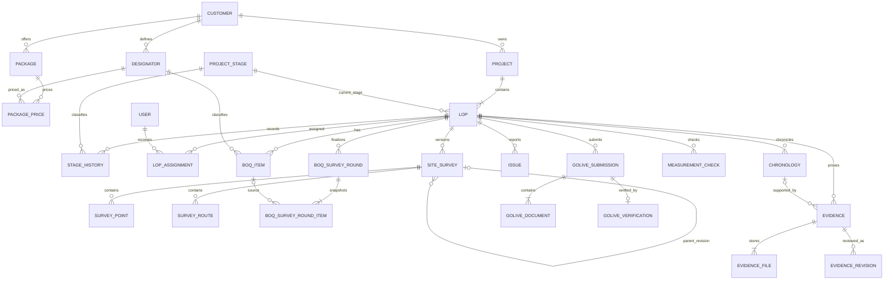

# CDM dan PDM Target DOMPIS CONS

Versi: 1.0 — 14 September 2026  
Status: **proposed target; belum diterapkan ke database**  
Basis: audit dump lama, dump 14 September 2026, migration Laravel sampai batch 39, dan metadata database aktif.

## 1. Batas rancangan

Dokumen ini membedakan:

- **CDM (Conceptual Data Model):** apa entitas bisnisnya, siapa pemilik data, dan bagaimana relasinya;
- **PDM (Physical Data Model):** bentuk tabel target, tipe data, key, constraint, dan index;
- **compatibility transition:** struktur sementara untuk memindahkan aplikasi tanpa big-bang.

PDM ini tidak mengizinkan status proses dikembalikan ke tabel Project. PDM juga tidak dibuat dengan menyalin dump phpMyAdmin secara langsung.

## 2. Keputusan arsitektur data

1. Project adalah header order/portofolio.
2. Project mempunyai satu atau banyak LOP.
3. LOP adalah aggregate root pekerjaan lapangan dan sumber status.
4. Survey, BOQ, eviden, kendala, kronologi, pengukuran, dan Golive dimiliki oleh LOP.
5. Survey dan BOQ Survey berversi; versi completed bersifat immutable.
6. `quantity_plan`, `quantity_survey`, dan `quantity_actual` adalah tiga fakta berbeda.
7. File multi-upload menjadi child rows, bukan array path yang sulit diaudit.
8. PT2 dipertahankan sebagai bounded context terpisah pada v1; unifikasi penuh adalah keputusan proyek lain.

## 3. CDM

### 3.1 Domain utama

| Domain | Entitas | Tanggung jawab |
|---|---|---|
| Access | User, Role, Permission | identitas, role, dan hak akses |
| Master komersial | Customer, Package, Designator, Package Price | katalog item, pasangan M/J, harga |
| Order | Project, LOP | header order dan unit kerja lapangan |
| Workflow | Project Stage, Stage History, Assignment | status, durasi, dan penanggung jawab LOP |
| Design/Survey | Site Survey, Survey Point, Survey Route | baseline KML, tagging, rute, dan histori redesign |
| BOQ | BOQ Item, Survey Round, Survey Round Item | plan, hasil survey terbaru, actual, dan snapshot ronde |
| Pelaksanaan | Evidence, Evidence File, Measurement | bukti pekerjaan dan hasil pengukuran |
| Issue/Permit | Issue, Permit Category, Chronology | kendala dan kronologi perizinan |
| Golive | Golive Submission, Golive Document, Verification | dokumen FI dan keputusan SDI |
| Integration | Import Process, Import Error, Notification, Telegram Event, GIS Export | proses asynchronous dan integrasi |
| PT2 | PT2 Project/LOP/BOQ/Survey/Evidence/Documents | alur PT2 yang dipisahkan sementara |

### 3.2 Diagram konseptual

### 3.3 Business rules dan kardinalitas

| ID | Aturan |
|---|---|
| BR-01 | Satu Customer dapat memiliki banyak Project, Package, dan Designator. |
| BR-02 | Satu Project wajib memiliki minimal satu LOP sebelum aktif operasional. |
| BR-03 | Satu LOP hanya mempunyai satu `status_progress` aktif. |
| BR-04 | Satu LOP boleh mempunyai banyak Site Survey, tetapi maksimal satu versi current. |
| BR-05 | Redesign/Re-Survey selalu membuat revision baru dengan referensi parent; versi completed lama tidak diubah. |
| BR-06 | Satu LOP maksimal memiliki satu BOQ Item per designator aktif. |
| BR-07 | Satu ronde BOQ Survey mempunyai nomor unik dalam LOP dan minimal satu snapshot item saat completed. |
| BR-08 | Item tambahan Survey boleh memiliki plan `NULL`; volume survey wajib diisi sebelum completed. |
| BR-09 | `pair_code` menggabungkan input M/J pada UI, bukan menghapus salah satu komponen harga. |
| BR-10 | `quantity_actual` tidak boleh digunakan sebagai volume Survey. |
| BR-11 | Eviden yang terkait BOQ/kronologi harus berasal dari LOP yang sama. |
| BR-12 | LOP Golive harus `status_progress='golive'`, `sdi_approval_status='approved'`, `is_golive=1`, dan memiliki waktu Golive. |
| BR-13 | Status Project dihitung dari LOP; tidak disimpan kembali di Project. |

## 4. Standar fisik global

### 4.1 Profil engine portabel

Sampai ADR engine disetujui:

- engine: InnoDB;
- charset: `utf8mb4`;
- collation: `utf8mb4_unicode_ci`;
- timezone penyimpanan: UTC; presentasi memakai Asia/Jakarta;
- ID: `BIGINT UNSIGNED` auto increment;
- uang: `DECIMAL(18,2)`;
- volume/panjang: `DECIMAL(18,3)` atau skala domain yang dinyatakan;
- koordinat: latitude `DECIMAL(10,7)`, longitude `DECIMAL(11,7)`;
- boolean: `TINYINT(1) NOT NULL DEFAULT 0` + check bila engine mendukung;
- status bisnis: `VARCHAR` + reference/check; hindari enum database untuk status yang berkembang;
- JSON hanya untuk payload fleksibel, bukan relasi atau daftar file utama.

Semua FK harus mempunyai tipe signed/unsigned, panjang, charset, dan collation yang identik dengan key parent.

### 4.2 Konvensi

- pertahankan nama PK legacy selama transition (`id_project`, `id_lop`, dan seterusnya) untuk menekan perubahan aplikasi;
- tabel baru menggunakan `id` atau nama konsisten yang disepakati sebelum DDL;
- semua tabel bisnis mempunyai `created_at` dan `updated_at` nullable timestamp;
- event/audit immutable dapat hanya mempunyai `created_at`;
- file menyimpan path relatif, disk, MIME, size, dan SHA-256; binary tidak disimpan di database;
- index FK wajib; composite index mengikuti filter nyata, bukan ditambah tanpa bukti query.

## 5. PDM target — master dan access

Notasi: `PK`, `FK`, `UQ` = primary, foreign, unique key. Kolom timestamp standar tidak diulang pada setiap baris.

### 5.1 `customers`

| Kolom | Tipe | Null/default | Key/aturan |
|---|---|---|---|
| `id_customer` | BIGINT UNSIGNED | no | PK |
| `customer_code` | VARCHAR(50) | no | UQ, canonical uppercase |
| `customer_name` | VARCHAR(255) | no | index pencarian bila diperlukan |
| `description` | TEXT | yes |  |
| `is_active` | TINYINT(1) | no/1 |  |

### 5.2 `packages`

| Kolom | Tipe | Null/default | Key/aturan |
|---|---|---|---|
| `id_package` | BIGINT UNSIGNED | no | PK |
| `customer_id` | BIGINT UNSIGNED | no | FK→customers RESTRICT |
| `package_code` | VARCHAR(50) | no | UQ `(customer_id, package_code)` |
| `package_name` | VARCHAR(150) | no |  |
| `description` | TEXT | yes |  |
| `is_active` | TINYINT(1) | no/1 |  |

### 5.3 `designators`

| Kolom | Tipe | Null/default | Key/aturan |
|---|---|---|---|
| `id_designator` | BIGINT UNSIGNED | no | PK |
| `customer_id` | BIGINT UNSIGNED | no | FK→customers RESTRICT |
| `designator` | VARCHAR(100) | no | UQ `(customer_id, designator)` setelah dedupe |
| `item_name` | VARCHAR(500) | no |  |
| `unit` | VARCHAR(50) | no |  |
| `type` | VARCHAR(20) | no | check `material/jasa` |
| `pair_code` | VARCHAR(100) | yes | index `(customer_id,pair_code,type)` |
| `progress_category` | VARCHAR(50) | no/`OTHER` |  |
| `requires_finishing_evidence` | TINYINT(1) | no/0 |  |
| `is_active` | TINYINT(1) | no/1 | soft-retire, jangan hard-delete master terpakai |

### 5.4 `designator_package_prices`

| Kolom | Tipe | Null/default | Key/aturan |
|---|---|---|---|
| `id_price` | BIGINT UNSIGNED | no | PK |
| `designator_id` | BIGINT UNSIGNED | no | FK→designators RESTRICT |
| `package_id` | BIGINT UNSIGNED | no | FK→packages CASCADE/RESTRICT sesuai ADR |
| `price` | DECIMAL(18,2) | no/0 | check `price>=0` |
| `valid_from` | DATE | yes | opsional bila histori harga diaktifkan |
| `valid_to` | DATE | yes | `NULL` berarti aktif |

Untuk model tanpa histori harga, gunakan UQ `(designator_id,package_id)`. Bila periode harga dipakai, ganti dengan constraint versi yang menjamin hanya satu periode aktif.

### 5.5 `roles`, `role_permissions`, `users`

| Tabel | Kolom inti | Constraint target |
|---|---|---|
| `roles` | `id_roles BIGINT`, `code VARCHAR(50)`, `name`, `description`, `is_active` | UQ `code` |
| `role_permissions` | `id`, `role_id`, `permission VARCHAR(150)` | FK role CASCADE; UQ `(role_id,permission)` |
| `users` | `id_user`, `nik`, `name`, `username`, `password`, `role_id`, `status`, login timestamps | UQ `username`; UQ `nik` untuk nilai non-null; FK role RESTRICT/SET NULL sesuai aturan deaktivasi |

`users.role` enum adalah transitional only dan dihapus setelah seluruh consumer membaca `role_id`.

## 6. PDM target — Project, LOP, dan workflow

### 6.1 `projects`

| Kolom | Tipe | Null/default | Key/aturan |
|---|---|---|---|
| `id_project` | BIGINT UNSIGNED | no | PK |
| `customer_id` | BIGINT UNSIGNED | no | FK→customers RESTRICT |
| `pid` | VARCHAR(100) | yes | index |
| `pid_sap` | VARCHAR(100) | yes | business UQ ditetapkan per customer setelah dedupe |
| `project_name` | VARCHAR(255) | no |  |
| `program` | VARCHAR(150) | yes | index untuk dashboard |
| `branch` | VARCHAR(100) | yes | index bersama program |
| `sto` | VARCHAR(50) | yes |  |
| `mitra_name` | VARCHAR(150) | yes |  |
| `execution_type` | VARCHAR(30) | yes | check `kemitraan/swakelola/turnkey` |
| lokasi/KML legacy | sesuai kebutuhan transition | yes | dipindah ke desain LOP secara bertahap |

Kolom `status`, `status_project`, `sdi_approval_status`, `is_golive`, `golive_evidence_path`, dan `golive_at` **tidak ada** pada target.

### 6.2 `lops`

| Kelompok kolom | Tipe/isi | Key/aturan |
|---|---|---|
| Identitas | `id_lop BIGINT UNSIGNED`, `project_id BIGINT UNSIGNED`, `id_ihld VARCHAR(100)`, `lop_name VARCHAR(255)`, `pid_sap VARCHAR(100)` | PK; FK project RESTRICT; business UQ ditetapkan dari hasil profiling |
| Klasifikasi | `package_id`, `program_sap`, `tematik`, `branch`, `sto`, `batch`, mitra | FK package; index dashboard `(branch,status_progress)` dan `(program_sap,status_progress)` |
| Order | nomor/tanggal SP/TOC, tahun, WO, estimasi | tipe DATE/YEAR/VARCHAR sesuai domain |
| Nilai | `nilai_material`, `nilai_jasa`, `nilai_total DECIMAL(18,2)` | check non-negatif; total dihitung/validasi |
| Kuantitas ringkas | ODP/port integer; tiang/kabel/galian `DECIMAL(18,3)` | jangan VARCHAR |
| Workflow | `status_progress VARCHAR(50)`, `status_progress_before_hold VARCHAR(50) NULL` | FK keduanya→project_stages.code |
| SDI/Golive | `sdi_approval_status VARCHAR(20)`, `is_golive TINYINT(1)`, `golive_at TIMESTAMP NULL` | index; check konsistensi BR-12 |
| Survey gate | `survey_deviation_percent DECIMAL(8,2)`, `survey_redesign_required TINYINT(1)` | current projection saja |
| Permit | `permit_category_id`, `perizinan_completed_at` | FK permit category SET NULL |
| Mapping | `mapping_status VARCHAR(30)` | check auto/manual/unmapped |

`golive_evidence_path` menjadi transitional dan dihapus setelah dokumen Golive ter-normalisasi.

### 6.3 `project_stages`

Pertahankan struktur `code`, `label`, `phase_group`, `sequence`, `color`, `is_pause_type`, `is_terminal`, `is_active`, `description`. `code` adalah UQ dan immutable setelah digunakan. DRM dapat tetap sebagai histori nonaktif, tetapi tidak muncul pada alur aktif.

### 6.4 `lop_stage_histories`

| Kolom | Tipe | Key/aturan |
|---|---|---|
| `id` | BIGINT UNSIGNED | PK |
| `lop_id` | BIGINT UNSIGNED | FK→lops CASCADE; index |
| `stage_code` | VARCHAR(50) | FK→project_stages.code RESTRICT |
| `entered_at` | TIMESTAMP | wajib |
| `completed_at` | TIMESTAMP NULL | harus ≥ entered_at |
| `completed_by` | BIGINT UNSIGNED NULL | FK→users SET NULL |
| `note` | TEXT NULL |  |

Aturan maksimal satu histori terbuka per LOP ditegakkan melalui transaksi/service dan pemeriksaan periodik; bila engine target mendukung partial/generated unique index, tambahkan constraint fisik.

### 6.5 `lop_assignments` (pengganti target `pro_assign`)

| Kolom | Tipe | Key/aturan |
|---|---|---|
| `id` | BIGINT UNSIGNED | PK |
| `lop_id` | BIGINT UNSIGNED | FK→lops CASCADE |
| `user_id` | BIGINT UNSIGNED | FK→users RESTRICT |
| `assignment_role` | VARCHAR(30) | waspang/teknisi/admin/role lain |
| `assigned_by` | BIGINT UNSIGNED NULL | FK→users SET NULL |
| `assigned_at` | TIMESTAMP | wajib |
| `ended_at` | TIMESTAMP NULL | current bila NULL |

Index `(lop_id,assignment_role,ended_at)` dan `(user_id,ended_at)`. `pro_assign` dipertahankan sebagai compatibility layer sampai seluruh consumer dipindahkan.

## 7. PDM target — Survey dan BOQ

### 7.1 `site_surveys`

| Kolom | Tipe | Null/default | Key/aturan |
|---|---|---|---|
| `id_site_surveys` | BIGINT UNSIGNED | no | PK |
| `lop_id` | BIGINT UNSIGNED | no | FK→lops CASCADE |
| `revision_no` | INT UNSIGNED | no | UQ `(lop_id,revision_no)` |
| `parent_survey_id` | BIGINT UNSIGNED | yes | self FK SET NULL |
| `source_type` | VARCHAR(20) | no | baseline/redesign/resurvey |
| `title` | VARCHAR(255) | no | default dari nama LOP |
| `surveyor_id` | BIGINT UNSIGNED | no | FK→users RESTRICT |
| `status` | VARCHAR(20) | no/draft | draft/completed/cancelled |
| `is_current` | TINYINT(1) | yes | hanya `1` atau `NULL`; UQ `(lop_id,is_current)` menjamin satu current |
| `source_kml_path` | VARCHAR(500) | yes | KML input/baseline |
| `design_kml_path` | VARCHAR(500) | yes | hasil desain revisi |
| ending site | koordinat + nama | yes |  |
| `notes`, `completed_at` | TEXT/TIMESTAMP | yes | completed_at wajib jika completed |

`project_id` dan `project_name` hanya transitional. Setelah backfill dan consumer pindah, Project diturunkan melalui `lops.project_id`.

### 7.2 `site_survey_points`

`id_site_survey_points BIGINT PK`, `site_survey_id BIGINT FK CASCADE`, `type VARCHAR(30)`, `catuan_type VARCHAR(30) NULL`, `name VARCHAR(255)`, latitude/longitude decimal, `photo_path VARCHAR(500)`, `notes`, `order_index INT UNSIGNED`, `created_by BIGINT FK SET NULL`. Index `(site_survey_id,type,order_index)`.

### 7.3 `site_survey_routes`

`id_site_survey_routes BIGINT PK`, `site_survey_id BIGINT FK CASCADE`, `name VARCHAR(255)`, `path JSON`, `distance_meters DECIMAL(14,3)`, `order_index INT UNSIGNED`. Index `(site_survey_id,order_index)`. Validasi setiap titik path dan batas ukuran dilakukan di aplikasi.

### 7.4 `boq_items`

| Kolom | Tipe | Null/default | Key/aturan |
|---|---|---|---|
| `id_boq` | BIGINT UNSIGNED | no | PK |
| `lop_id` | BIGINT UNSIGNED | no | FK→lops CASCADE |
| `designator_id` | BIGINT UNSIGNED | no | FK→designators RESTRICT |
| snapshot kode/nama/unit | VARCHAR | no | mempertahankan label saat master berubah |
| `quantity_plan` | DECIMAL(18,3) | yes | baseline admin |
| `quantity_survey` | DECIMAL(18,3) | yes | latest completed Survey projection |
| `quantity_actual` | DECIMAL(18,3) | yes | realisasi instalasi saja |
| `unit_price` | DECIMAL(18,2) | yes | snapshot harga bila diperlukan |
| `actual_reason` | TEXT | yes | wajib jika aturan deviasi actual memerlukan |
| `is_active` | TINYINT(1) | no/1 | item lama tidak hard-delete bila sudah masuk histori |

UQ `(lop_id,designator_id)` dan index `(lop_id,is_active)`. `project_id` transitional dan dihapus setelah seluruh query memakai relasi LOP. `total_price` lebih aman dihitung; bila disimpan harus divalidasi terhadap quantity × unit price.

### 7.5 `boq_survey_rounds`

Struktur dump baru dipertahankan dengan pengetatan:

- PK `id`; FK `lop_id`, `started_by`, `finished_by`;
- UQ `(lop_id,round_number)`;
- status `draft/completed/cancelled`;
- total plan/survey `DECIMAL(18,2)` dan deviasi `DECIMAL(8,2)`;
- completed wajib memiliki `finished_by`, `finished_at`, total, dan snapshot item;
- row completed tidak boleh di-update kecuali melalui proses koreksi audit khusus.

### 7.6 `boq_survey_round_items`

| Kelompok | Isi |
|---|---|
| Relasi | `boq_survey_round_id FK CASCADE`; `boq_item_id NULL` tanpa cascade agar histori bertahan; `designator_id NULL`/SET NULL |
| Snapshot | designator, item_name, unit, pair_code, type |
| Angka | quantity plan/survey `DECIMAL(18,3)`, unit price `DECIMAL(18,2)`, amount plan/survey `DECIMAL(18,2)` |
| Flag | `is_additional TINYINT(1)` |

Index `(boq_survey_round_id)`, `(boq_item_id)`, dan `(designator_id)`. Tambahkan UQ `(boq_survey_round_id,boq_item_id)` untuk item yang mempunyai sumber BOQ; item snapshot tanpa sumber memakai identitas snapshot tersendiri.

## 8. PDM target — eviden, kendala, kronologi

### 8.1 `evidences`

Target inti: `id_evidence PK`, `lop_id FK`, `boq_item_id NULL FK SET NULL`, `lop_kronologi_id NULL FK SET NULL`, `uploaded_by FK RESTRICT`, `stage_code FK→project_stages`, `evidence_type`, koordinat decimal, description, `status`, review note/timestamps. Index `(lop_id,stage_code,status)` dan `(boq_item_id,status)`.

`project_id` transitional dan akhirnya dihapus. `file_path` tunggal dipindah ke child `evidence_files`.

### 8.2 `evidence_files`

Remodel tabel kosong menjadi:

| Kolom | Tipe/aturan |
|---|---|
| `id` | BIGINT UNSIGNED PK |
| `evidence_id` | BIGINT UNSIGNED FK→evidences CASCADE |
| `disk` | VARCHAR(50) |
| `file_path` | VARCHAR(500) |
| `original_name` | VARCHAR(255) NULL |
| `mime_type` | VARCHAR(100) NULL |
| `size_bytes` | BIGINT UNSIGNED NULL |
| `sha256` | CHAR(64) NULL |
| `is_primary` | TINYINT(1) default 0 |
| `uploaded_at` | TIMESTAMP |

UQ `(disk,file_path)` dan index `(evidence_id,is_primary)`.

### 8.3 Entitas terkait

| Tabel | Target utama |
|---|---|
| `evidence_revision_histories` | FK evidence/project or LOP/reviewer; snapshot status/review note; immutable |
| `lop_measurement_checks` | UQ `(lop_id,item_key)`; FK evidence dan checked_by |
| `measurements` | FK evidence; `type`; nilai numerik `DECIMAL`, unit, threshold status |
| `project_issues` | pindahkan ownership ke `lop_id`; FK user, stage, kendala category; status terkontrol |
| `lop_kronologis` | `project_id` dihapus setelah transition; FK LOP, stage, permit category, creator |
| `project_activity_logs` | event immutable; `lop_id` kanonik untuk event LOP; metadata JSON; jangan cascade-delete log audit |

## 9. PDM target — Golive

### 9.1 `lop_golive_submissions`

Ubah dari satu row per LOP menjadi submission berversi:

- `id PK`, `lop_id FK`, `submission_no INT`, `status VARCHAR(20)`, `mancore_input_type`, `fi_completed_at`, `submitted_by`, `submitted_at`;
- UQ `(lop_id,submission_no)`;
- index `(lop_id,status,submitted_at)`;
- kolom path tunggal dan JSON array menjadi transitional, lalu dihapus setelah file dipindah.

### 9.2 `lop_golive_documents`

`id PK`, `submission_id FK CASCADE`, `document_type VARCHAR(40)` (`capture_valins`, `abd_valid4`, `kml`, `mancore`, dan tipe berikutnya), `disk`, `file_path`, metadata file, `uploaded_by`, `uploaded_at`. UQ `(submission_id,document_type,file_path)`.

### 9.3 `lop_golive_verifications`

Gunakan `submission_id FK` sebagai objek yang diverifikasi, ditambah `decision`, `capture_uim` melalui attachment/document, `note`, `verified_by`, dan `verified_at`. Satu submission maksimal satu keputusan final. Transaksi approval harus sekaligus memperbarui current projection pada LOP.

## 10. PDM target — import dan integrasi

| Tabel | Disposition target |
|---|---|
| `import_processes` | kanonik; pertahankan UUID, status, progress, counters, summary JSON, uploader, waktu |
| `import_processes_errors` | pertahankan per-row error; FK CASCADE; index process+row/error code |
| `import_logs` | compatibility sementara; jangan kurangi kolom selama legacy job masih menulisnya; akhirnya jadikan view/ringkasan atau pensiunkan |
| `gis_cad_exports` | tambahkan `lop_id`/survey revision sebagai sumber utama; project diturunkan |
| `notifications` | FK user; target LOP/project nullable sesuai event; index unread per user |
| `telegram_webhook_events` | FK target bila retention mengizinkan; index status/created/retry |

Tabel framework `cache`, `cache_locks`, `jobs`, `job_batches`, `failed_jobs`, `sessions`, `password_reset_tokens`, dan `migrations` berada di luar CDM bisnis tetapi tetap ada pada PDM deployment Laravel.

## 11. PDM target — PT2 v1

PT2 tetap menggunakan tabel fisik terpisah untuk menjaga kompatibilitas:

- `pt2_projects` tidak memiliki kolom status;
- `pt2_lops` menyimpan `status_progress`, `sdi_approval_status`, `is_golive`, dan waktu/bukti Golive;
- seluruh `pt2_*` memakai `BIGINT UNSIGNED`, satu collation, dan `DECIMAL` untuk uang/volume;
- tambahkan FK customer/package/designator/user yang saat ini hilang;
- pasangan `pt2_project_id` + `pt2_lop_id` pada child harus konsisten;
- Survey, BOQ, evidence, dismantle, mancore, BAUT, dan LACT tetap terikat ke PT2 LOP;
- `mancores_pt2` dan `surveys_pt2` tetap dipertahankan karena masih aktif; migration batch 26 hanya menghapus tabel legacy bernama terbalik `pt2_mancores` dan `pt2_surveys`.

Unifikasi v2 hanya boleh dilakukan jika seluruh use case PT2 dapat dipetakan ke model generik tanpa kehilangan field atau alur approval.

## 12. Mapping current ke target

| Current | Target | Cara transisi |
|---|---|---|
| `projects.status*`, SDI, Golive | kolom pada `lops` | sudah dimigrasikan di DB aktif; cegah regresi dump |
| `Project::lop()` | `Project::lops()` / LOP eksplisit | migrasi consumer per fitur |
| `site_surveys.project_id` | `site_surveys.lop_id` | expand, deterministic backfill, exception list, contract |
| `projects.kml_file` | revision baseline Site Survey | salin sebagai revision 1 per LOP yang valid |
| `boq_items.project_id` | derived melalui `lop_id` | validasi pasangan, pindahkan query, lalu drop |
| harga/nilai VARCHAR/DOUBLE | DECIMAL | kolom bayangan + parser + reconciliation |
| `evidences.project_id/file_path` | `evidences.lop_id` + `evidence_files` | backfill dari BOQ/LOP/project; copy path sebagai primary file |
| `pro_assign` | `lop_assignments` | perluas assignment Project ke tiap LOP dengan exception review |
| path/JSON Golive | `lop_golive_documents` | unnest per path dan checksum |
| `import_logs` legacy | `import_processes` | pindahkan consumer/job; pertahankan compatibility sampai nol pemakai |
| `users.role` | `users.role_id` | audit parity, switch authorization, drop enum |

## 13. Index minimum untuk workload utama

| Use case | Index target |
|---|---|
| Dashboard/filter LOP | `lops(branch,status_progress)`, `lops(program_sap,status_progress)`, `lops(project_id)` |
| SDI/Golive | `lops(sdi_approval_status,is_golive,status_progress)` |
| Latest Survey | `site_surveys(lop_id,is_current)`, UQ `(lop_id,revision_no)` |
| Timeline | `lop_stage_histories(lop_id,entered_at)`, `(stage_code,completed_at)` |
| BOQ per LOP | UQ `boq_items(lop_id,designator_id)` |
| Latest round | UQ `boq_survey_rounds(lop_id,round_number)` |
| Eviden approval | `evidences(lop_id,stage_code,status)` |
| Kendala aktif | `project_issues(lop_id,status,stage_code)` |
| Import monitor | `import_processes(status,created_at)`, UQ UUID |
| Notification inbox | `notifications(user_id,is_read,created_at)` |

Index akhir harus divalidasi dengan `EXPLAIN` dan slow query, karena terlalu banyak index juga menambah biaya write.

## 14. Constraint yang dipasang setelah cleanup

1. FK `lops.project_id` setelah empat LOP yatim direkonsiliasi.
2. FK BOQ/Eviden/Issue/Activity setelah seluruh orphan dan pasangan project–LOP bernilai nol.
3. UQ `(customer_id,designator)` setelah 176 kelompok master designator dideduplikasi.
4. UQ Project PID SAP setelah satu kelompok duplikat mendapat disposition.
5. FK dan UQ Site Survey setelah `lop_id` selesai dibackfill.
6. UQ user username/NIK setelah validasi akhir, walaupun audit kini tidak menemukan duplikat.
7. Check status Golive dan completed Survey setelah data lama diperbaiki.

## 15. Definition of done PDM

PDM siap diterjemahkan menjadi migration hanya apabila:

- engine target sudah dipilih;
- seluruh business key sudah disetujui data owner;
- aturan delete (`CASCADE/RESTRICT/SET NULL`) ditandatangani per relasi;
- mapping Site Survey Project→LOP mempunyai hasil deterministik;
- strategi PT2 diputuskan untuk v1;
- seluruh P0/P1 pada audit memiliki owner dan acceptance criteria;
- ERD, data dictionary, dan migration plan menunjukkan versi yang sama.
